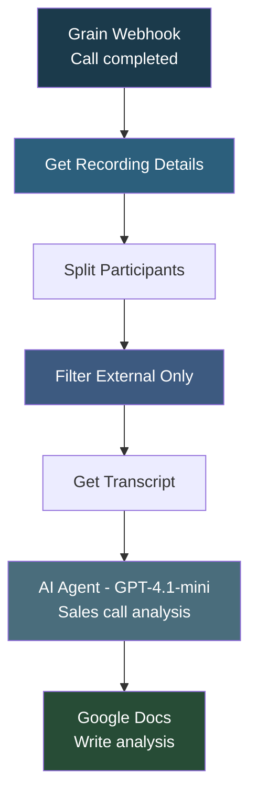

# Grain Post Call Automation

## Overview

This automation **analyzes sales call recordings from Grain and generates structured post-call documentation using AI**. When a call ends, Grain sends a webhook, the workflow fetches the recording and transcript, filters to external participants only, and uses GPT-4.1-mini to produce a comprehensive sales analysis including call overview, discovery highlights, objections, next steps, coaching notes, and follow-up email points. The analysis is automatically written to a Google Doc.

## How It Works

```
Grain Webhook -> Get Recording -> Split Participants -> Filter External -> Get Transcript -> AI Analysis (GPT-4.1-mini) -> Write to Google Doc
```

### Workflow Diagram



## Integrations

- **Grain** - Call recording and transcript source
- **OpenAI (GPT-4.1-mini)** - Sales call analysis
- **Google Docs** - Analysis document output

## Setup

1. Import `Grain_Post_Call_Automation.json` into your n8n instance.
2. Update credentials for Grain API, OpenAI, and Google Docs.
3. Update the Google Doc ID in the "Update a document" node.
4. Configure the Grain webhook to point to this workflow's webhook URL.
5. Activate the workflow.
